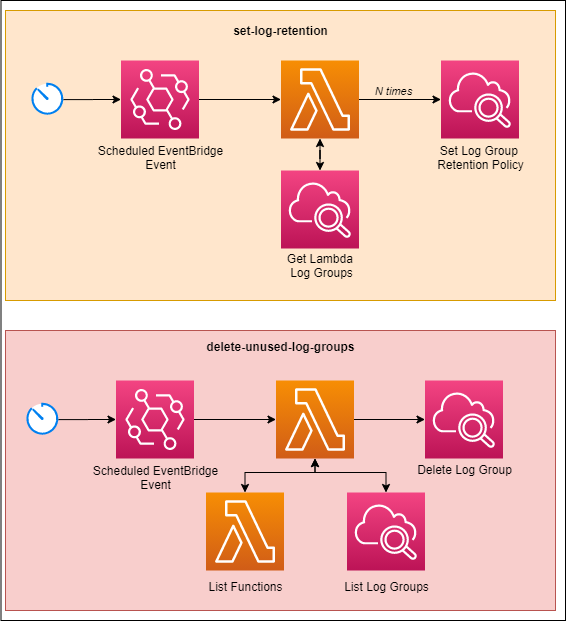

# Manage Lambda Logs Generated By a SAM Template

With SAM, there isn't an easy way to configure log group retention for lambda functions. You must create a log group resource and give it the same name as the function being created.

If you try to do this after a log group has already been created, you must delete the log group first. Then you may redeploy and have your associated log group.

But is that worth it?

## In This Stack

Two lambdas are provided in this stack:
* **delete-unused-log-groups** - Removes and lambda log groups that remained when a lambda resource name changed
* **set-log-retention** - Sets all lambda function log groups to have a retention period defined in an environment variable

## Schedule
 
The lambdas are triggered on a schedule so you don't have to maintain anything as you continue to build. 

#### set-log-retention

This lambda is configured by default to run every day at 2AM UTC. It will set the log retention of all lambdas that do not match the configured retention period in the lambda environment variable.

#### delete-unused-log-groups

Set to run every 7 days. As this is likely a much less frequently needed lambda function, you might be able to run it on demand. Resource names do not change frequently (really only when [developers change it manually](https://docs.aws.amazon.com/AWSCloudFormation/latest/UserGuide/aws-resource-lambda-function.html#cfn-lambda-function-functionname)), so this lambda is set less frequently to run.

## Deployment

This template comes configured with a `samconfig.toml` file which you can update to match resources in your account. Once you have updated the configuration, you can run the `npm run deploy` or `sam deploy` command to trigger the deployment into your AWS account.

## Things of Note

This project uses the [AWS v3 SDK](https://docs.aws.amazon.com/AWSJavaScriptSDK/v3/latest/index.html) to perform all interactions with the infrastructure. Version 3 of the SDK is not included by default in the lambda environment, so it has been included in a [lambda layer](https://www.readysetcloud.io/blog/allen.helton/how-to-build-both-kinds-of-aws-lambda-layers-yes-there-are-two-edb945979f17/) so the code is still visible in the AWS console should you choose to edit it.

The lambda functions are running *nodejs14.x* and are executed on the *arm64 architecture* aka [AWS Graviton2 processor](https://aws.amazon.com/blogs/aws/aws-lambda-functions-powered-by-aws-graviton2-processor-run-your-functions-on-arm-and-get-up-to-34-better-price-performance/).

## Contact
You can show your support by following me on [Twitter][1] or connecting with me on [LinkedIn][3]. I'm always happy to answer any questions you might have and am open to any ideas you'd like to see!

[1.1]: http://i.imgur.com/tXSoThF.png
[2.1]: http://i.imgur.com/0o48UoR.png
[3.1]: http://i.imgur.com/lGwB1Hk.png
[4.1]: https://readysetcloud.s3.amazonaws.com/logo.png

[1]: http://www.twitter.com/allenheltondev
[2]: http://www.github.com/allenheltondev
[3]: https://www.linkedin.com/in/allen-helton-85aa9650/
[4]: https://readysetcloud.io
